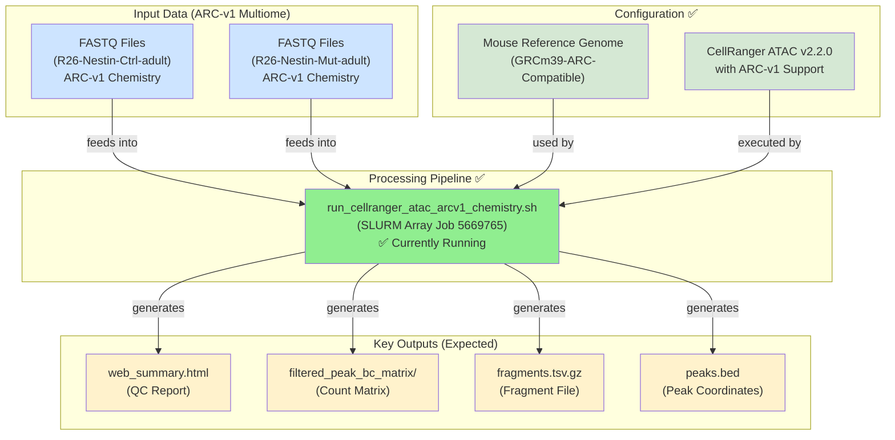
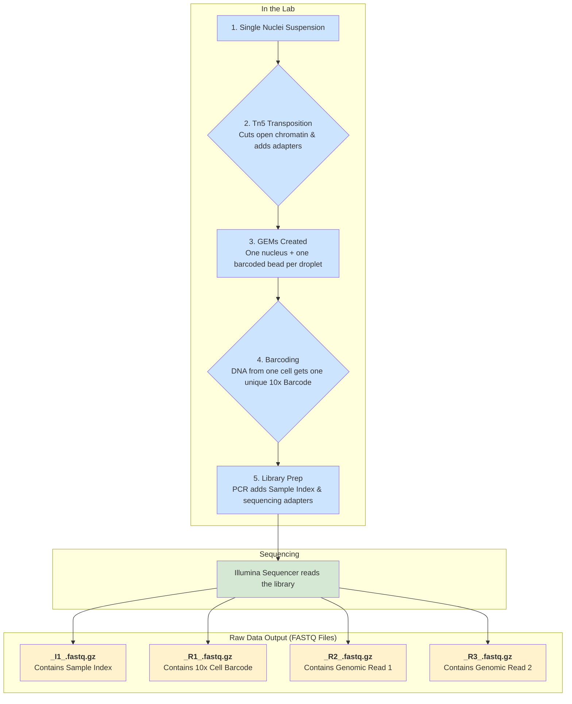
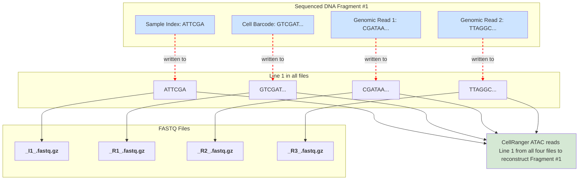
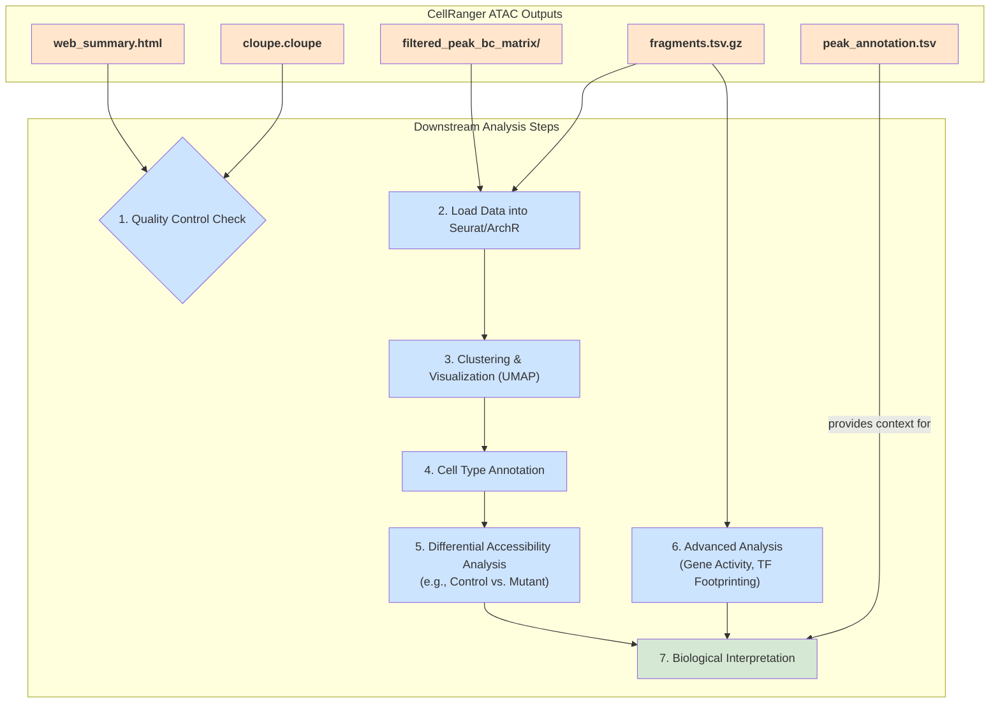

Terms:
- [[peak-barcode matrix]]
- [[footprinting]]
- [[trajectory analysis]]
- [[Tn5 transposase enzyme]]
- 

This pipeline is built around 10x Genomics' `CellRanger ATAC` software with **ARC-v1 multiome chemistry compatibility**.

**🎉 Pipeline Status**: ✅ **Successfully resolved and running** (Job 5669765)

### 1. The Goal: Processing Raw Sequencing Data into Usable Results

The primary objective of this pipeline is to take raw sequencing data (FASTQ files) from two mouse samples (`R26-Nestin-Ctrl-adult` and `R26-Nestin-Mut-adult`) and process it.
The key output is a "`peak-barcode matrix`," which tells you which regions of chromatin are accessible (open) in each individual cell.

**Key Discovery**: This data uses **ARC-v1 multiome chemistry**, the same chemistry used for successful RNA processing of these samples.

---

### 2. The Main Processing Script: `run_cellranger_atac_arcv1_chemistry.sh` ✅

#### Key Functions:
*   **Parallel Processing**: It's set up as a SLURM "array job" (`--array=0-1`) to process both the Control and Mutant samples simultaneously, each as a separate job.
*   **Resource Allocation**: It requests specific computational resources: 16 CPU cores, 128 GB of RAM, and a maximum runtime of 120 hours per sample.
*   **Environment Setup**: It configures the environment to ensure `CellRanger ATAC` runs smoothly, for instance, by preventing potential file system errors (`export CELLRANGER_COPY_MODE=copy`).
*   **Input File Management**: It doesn't work on the raw data files directly. Instead, it creates symbolic links (`ln -sf`) to the required FASTQ files, renaming them to match the specific format that `CellRanger ATAC` expects. This is a best practice that *avoids data duplication and keeps the original data safe*.
*   **Execution**: The heart of the script is the `cellranger-atac count` command. This single command performs all the necessary steps:
    1.  *Aligning* sequencing reads to the mouse reference genome.
    2.  Identifying *cell barcodes to demultiplex* data from single cells.
    3.  "*Calling peaks*" – identifying regions of open chromatin.
    4.  Generating the final *count matrices* and *quality control reports*.

#### Inputs for `run_cellranger_atac_nestin.sh`:
1.  **`CellRanger ATAC` Executable**: The path to the installed software:
    *   [`/beegfs/scratch/ric.sessa/kubacki.michal/tools/cellranger-atac-2.2.0/cellranger-atac`](/beegfs/scratch/ric.sessa/kubacki.michal/tools/cellranger-atac-2.2.0/cellranger-atac)
2.  **Reference Genome**: A special ATAC-specific mouse reference genome (`GRCm39`):
    *   [`/beegfs/scratch/ric.sessa/kubacki.michal/COMMONS/refdata-cellranger-arc-GRCm39-2024-A`](/beegfs/scratch/ric.sessa/kubacki.michal/COMMONS/refdata-cellranger-arc-GRCm39-2024-A)
3.  **Raw Data (FASTQ files)**: Located in the `nestin/` directory. For each sample, there are four critical files with **ARC-v1 multiome structure**:
    *   `_I1_001.fastq.gz`: 8bp *Sample index* reads.
    *   `_R1_001.fastq.gz`: 50bp *Genomic DNA reads* (not cell barcodes as in standard ATAC-seq).
    *   `_R2_001.fastq.gz`: 24bp *UMI + linker sequences*.
    *   `_R3_001.fastq.gz`: 49bp *Genomic DNA reads* (paired-end with R1).

**Important**: This ARC-v1 multiome structure differs from standard 10x ATAC-seq, requiring specialized processing.

---

### 3. The Output Files: What the Pipeline Generates

The script organizes the results into a clear structure within the `ATAC_data/cellranger_atac_arcv1_output/` directory. For each sample, a results folder is created (e.g., `R26-Nestin-Ctrl-adult_atac_arcv1_results/`).

#### Most Important Outputs:
*   **`web_summary.html`**: An interactive HTML report with quality control metrics. This is the **first file you should look at** to assess if the run was successful. It provides information on sequencing quality, cell calling, and mapping rates.
*   **`filtered_peak_bc_matrix/`**: This directory contains the primary result: a filtered matrix of *accessible chromatin peaks* (rows) by *cell barcodes* (columns). This is the main input for downstream analysis tools like [[Seurat]] or [[ArchR]].
*   **`fragments.tsv.gz`**: A crucial file for advanced ATAC-seq analysis. It lists *every single valid DNA fragment*, its genomic coordinates, and which cell it came from. This is used for tasks like [[footprinting]] (identifying transcription factor binding sites) and [[trajectory analysis]].
*   **`peaks.bed`**: A standard BED file listing the *genomic coordinates of all identified open chromatin peaks*.
*   **`peak_annotation.tsv`**: This file *annotates each peak with the nearest gene*, which helps in linking accessible regions to potential gene regulation.

---

### 4. Documentation and Helper Scripts

The project is well-documented.
*   [`README_ATAC_Processing.md`](ATAC_data/README_ATAC_Processing.md): Comprehensive technical overview of the pipeline, data structure, requirements, and key differences compared to RNA-seq processing.
*   [`QUICK_START_GUIDE.md`](ATAC_data/QUICK_START_GUIDE.md): A user-friendly guide that gets straight to the point: how to run the analysis and what to expect.
*   [`install_cellranger_atac.sh.backup`](ATAC_data/install_cellranger_atac.sh.backup): This is an installation script for `CellRanger ATAC`. It automates the download, integrity check (using MD5 checksum), and setup of the software, ensuring a reproducible environment.

### Summary Diagram - UPDATED

Here is a Mermaid diagram illustrating the **resolved workflow**:

**Resolution Note**: The pipeline initially failed due to unrecognized ARC-v1 multiome chemistry. The solution was discovered by examining the successful RNA processing script for the same samples, which revealed the `--chemistry=ARC-v1` parameter usage.

### The Lab Process: From Single Cells to Sequencable DNA

The technology used here is 10x Genomics Single Cell ATAC-seq. 
The core idea is to isolate individual cell nuclei and tag the accessible DNA within each one with a unique barcode.
Here is a step-by-step overview of the lab workflow:

1.  **Sample Preparation**: You start with a tissue sample (e.g., from the mouse brain in your case). The tissue is dissociated to create a suspension of single nuclei.
2.  **Transposition**: The suspension of nuclei is incubated with a **[[Tn5 transposase enzyme]]**. This is the magic of ATAC-seq. The Tn5 enzyme *simultaneously cuts DNA in open chromatin regions and inserts sequencing adapters* into those cuts. Closed, tightly-wound chromatin is protected from the enzyme.
3.  **GEM Generation (Gel Bead-in-Emulsion)**: This is the core 10x Genomics technology. The nuclei are mixed with barcoded gel beads and oil to create millions of tiny droplets called GEMs. Each GEM ideally contains a *single nucleus and a single gel bead*. The gel bead is coated with millions of copies of a unique **10x Barcode**.
4.  **Barcoding**: Inside each GEM, the gel bead dissolves. The barcoded oligonucleotides are released and attached to the DNA fragments that were tagged by the Tn5 transposase. This step ensures that all DNA fragments from the *same cell* get the *same 10x Barcode*.
5.  **Library Construction**: The GEMs are broken, and the barcoded DNA from all cells is pooled. PCR is used to amplify this DNA, *adding the final sequences needed for the Illumina sequencer* (like the sample index and read handles).

This entire process results in a final "library" of DNA fragments ready for sequencing. Each fragment has several key components attached to it.

### The Sequencing Data: Understanding the FASTQ Files

The Illumina sequencer reads this library and generates the *four FASTQ files* you see for each sample. 
Each file contains a different piece of the puzzle.
Let's look at the structure of a final, ready-to-sequence DNA fragment:

`[P5_Adapter]--[Read_1]--[10x_Barcode]--[Spacer]--[Read_2_Primer]--[**Genomic_DNA_Insert**]--[Read_3_Primer]--[Sample_Index]--[P7_Adapter]`

The sequencer performs *four different "reads"* to capture all this information, which correspond directly to your four FASTQ files:

1.  **`_I1_001.fastq.gz` (Index Read 1)**
    *   **Content**: The **Sample Index**.
    *   **Purpose**: In a typical sequencing run, multiple samples (e.g., your Control and Mutant) are pooled and sequenced together. This index is used by the `cellranger-atac` software to figure out which sequencing reads belong to the `R26-Nestin-Ctrl-adult` sample and which belong to the `R26-Nestin-Mut-adult` sample.

2.  **`_R1_001.fastq.gz` (Read 1)** - **ARC-v1 Multiome Structure**
    *   **Content**: **50bp Genomic DNA reads** (not cell barcodes as in standard ATAC-seq).
    *   **Purpose**: In ARC-v1 multiome chemistry, R1 contains genomic DNA sequences that are aligned to the reference genome. The cell barcoding happens through a different mechanism in the multiome protocol.

3.  **`_R2_001.fastq.gz` (Read 2)** - **ARC-v1 Multiome Structure**
    *   **Content**: **24bp UMI + linker sequences**.
    *   **Purpose**: Contains unique molecular identifiers and adapter sequences specific to the ARC-v1 multiome chemistry. This differs from standard ATAC-seq where R2 would contain genomic DNA.

4.  **`_R3_001.fastq.gz` (Read 3)** - **ARC-v1 Multiome Structure**
    *   **Content**: **49bp Genomic DNA reads** (paired-end with R1).
    *   **Purpose**: The other end of the genomic DNA fragment. Using both `R1` and `R3` (paired-end reads) allows for accurate alignment to the genome and defines the boundaries of accessible chromatin regions.

**Key Difference**: ARC-v1 multiome chemistry uses a different read structure than standard 10x ATAC-seq, which initially caused processing failures until the correct chemistry was identified.

### Summary Diagram: From Lab to Files

Here is a Mermaid diagram to visualize the connection between the lab process and the data:

So, when you run `cellranger-atac count`, it cleverly uses the information from all four files simultaneously:
*   It uses `I1` to pick out the reads for the correct sample.
*   It uses `R1` to group the genomic reads by their cell of origin.
*   It uses `R2` and `R3` to map those genomic reads to the reference genome, identifying the exact locations of open chromatin.

---

 The magic that links the reads from the different FASTQ files together is their **order**.

**Every read at the same line number across all four files belongs to the same original DNA fragment.**

Let's break this down. When the Illumina sequencer processes your library, it reads the different parts of a single DNA molecule (the sample index, the cell barcode, and the two ends of the genomic DNA) in a single cycle on its flow cell. It then writes the results of these reads to the four different output files, but it **maintains the exact same order** for every fragment it sequences.

### An Example

Imagine the sequencer processes three DNA fragments one after another. The output FASTQ files would look conceptually like this:

**File: `_I1_001.fastq.gz` (Sample Index)**
1.  `Read for Fragment 1's Sample Index`
2.  `Read for Fragment 2's Sample Index`
3.  `Read for Fragment 3's Sample Index`
4.  ...and so on

**File: `_R1_001.fastq.gz` (Cell Barcode)**
1.  `Read for Fragment 1's Cell Barcode`
2.  `Read for Fragment 2's Cell Barcode`
3.  `Read for Fragment 3's Cell Barcode`
4.  ...and so on

**File: `_R2_001.fastq.gz` (Genomic Read 1)**
1.  `Read for Fragment 1's Genomic DNA (end 1)`
2.  `Read for Fragment 2's Genomic DNA (end 1)`
3.  `Read for Fragment 3's Genomic DNA (end 1)`
4.  ...and so on

**File: `_R3_001.fastq.gz` (Genomic Read 2)**
1.  `Read for Fragment 1's Genomic DNA (end 2)`
2.  `Read for Fragment 2's Genomic DNA (end 2)`
3.  `Read for Fragment 3's Genomic DNA (end 2)`
4.  ...and so on

When `cellranger-atac` starts processing, it reads the first entry from `I1`, `R1`, `R2`, and `R3` simultaneously. It knows all four of these reads describe the very first fragment. Then it moves to the second line in all four files to assemble the information for the second fragment, and so on.

This strict, synchronized order is a fundamental principle of Illumina sequencing data. It's what allows bioinformatic software to correctly reconstruct the full information for each of the millions of DNA fragments that were sequenced.

### The FASTQ Read Header

This synchronization is also reflected in the FASTQ file format itself. Each read in a FASTQ file has a header line that starts with `@`. This header contains information about the sequencing run, the position on the flow cell, etc. **This header is identical for all corresponding reads across the different files.**

For example, line 1 of `_R1_001.fastq.gz` and line 1 of `_R2_001.fastq.gz` will have the exact same header string, confirming they are mates from the same sequencing event.

Here is a diagram illustrating this concept:

This is why it's critically important that the order of reads in these files is never altered. If you were to, for example, shuffle the lines in one of the files, the link between the cell barcode and the genomic DNA would be broken, and the entire analysis would fail.

---

# Output files 

The main results are located in the `outs/` directory for each sample (e.g., `R26-Nestin-Ctrl-adult_atac_arcv1_results/`).

**Current Status**: ✅ Pipeline is actively processing both samples (Job 5669765). Results expected in 8-18 hours.

### 1. The First Stop: Quality Control

#### `web_summary.html`
*   **What it is**: An interactive HTML report summarizing the entire run.
*   **How to use it**: **This is always the first file you should examine.** Open it in a web browser. It provides critical quality control (QC) metrics at a glance, such as:
    *   **Estimated Number of Cells**: How many *high-quality cells* were detected.
    *   **Sequencing Saturation**: Tells you if you have *sequenced deep* enough to capture most of the *complexity* in your library. High saturation (`>70-80%`) is good.
    *   **Fraction of Reads in Peaks**: The *percentage of reads that fall within open chromatin regions*. A higher percentage (e.g., `> 40-50%`) indicates good *signal-to-noise ratio*.
    *   **TSS Enrichment Score**: A key metric for ATAC-seq quality. It measures the *enrichment of reads around transcription start sites (TSS)*, which are expected to be open. A score `> 6-7` is generally considered good.
---

### 2. The Core Data for Analysis: Matrices and Fragments

This is the data you will load into analysis software like [[Seurat]] (R), [[ArchR]] (R), or [[Scanpy]] (Python).
#### `filtered_peak_bc_matrix/`
*   **What it is**: A directory containing the main data matrix in a *sparse format* (Matrix Market format). It represents the *count of accessible sites (peaks) per cell*.
    *   `barcodes.tsv.gz`: A list of *all cell barcodes* that passed filtering.
    *   `features.bed.gz`: The genomic coordinates of *all the detected peaks*.
    *   `matrix.mtx.gz`: The actual count data. Each entry represents the number of reads from a specific cell (barcode) that fall within a specific accessible region (peak).
*   **How to use it**: This is the **primary input for most standard downstream analyses**. You will load this directory into your analysis tool to create a single-cell object. This object is the foundation for:
    *   **Clustering**: Grouping cells into different types based on their chromatin accessibility profiles.
    *   **Visualization**: Creating UMAP or t-SNE plots to visualize the relationships between cells.
    *   **Differential Accessibility Analysis**: Identifying which chromatin regions are more or less accessible between different conditions (e.g., your Control vs. Mutant samples).

#### `fragments.tsv.gz` & `fragments.tsv.gz.tbi`
*   **What it is**: A comprehensive list of every single valid DNA fragment from the experiment. Each row contains the chromosome, start coordinate, end coordinate, and the cell barcode it belongs to. The `.tbi` file is an [[index]] that allows for very fast data retrieval from this large file.
*   **How to use it**: This file is essential for *more advanced and nuanced analyses* that go beyond simple peak counts.
    *   **Gene Activity Scores**: By looking at fragments in gene bodies and promoter regions, you can infer a *"gene activity" score*, which approximates gene expression. This allows you to use tools designed for scRNA-seq to help annotate your cell clusters.
    *   **Transcription Factor (TF) Footprinting**: Analyzing the patterns of Tn5 insertion sites within a peak can reveal "footprints" where TFs are bound to the DNA, protecting it from the enzyme. This helps identify which TFs are active in which cell types.
    *   **Trajectory Analysis**: By analyzing subtle changes in chromatin accessibility, you can model developmental processes or cell state transitions.
    *   **Aggregate Signal Plots**: You can create plots showing the average accessibility signal across all cells of a certain type around specific genomic features (like the binding sites of a particular TF).

---

### 3. Annotation and Visualization Files

These files provide context and are useful for deeper exploration.

#### `peak_annotation.tsv`
*   **What it is**: A table that links each peak ID (from `features.bed`) to the nearest gene, its distance to that gene's TSS, and the type of genomic feature it's in (promoter, intron, etc.).
*   **How to use it**: When you find a set of differentially accessible peaks between your control and mutant samples, you can use this file to quickly identify which genes are likely being regulated by those peaks. This is crucial for forming biological hypotheses.

#### `cloupe.cloupe`
*   **What it is**: A file for 10x Genomics' free Loupe Browser software.
*   **How to use it**: This is a great starting point for interactive data exploration without writing any code. You can open this file in Loupe Browser to:
    *   View the cell clustering (UMAP).
    *   Explore differentially accessible peaks.
    *   Link accessibility peaks to nearby genes.
    *   Visualize the accessibility signal at specific genes or genomic regions.

### Summary of a Typical Analysis Workflow

Here is a diagram showing how these files are used in a typical downstream analysis project:

In short:
1.  **Start with `web_summary.html`** to check QC.
2.  **Use `filtered_peak_bc_matrix/`** as the main input for clustering and differential analysis.
3.  **Use `fragments.tsv.gz`** for deeper, more advanced analyses like gene activity and TF motif analysis.
4.  **Use `peak_annotation.tsv`** to link your findings back to specific genes.